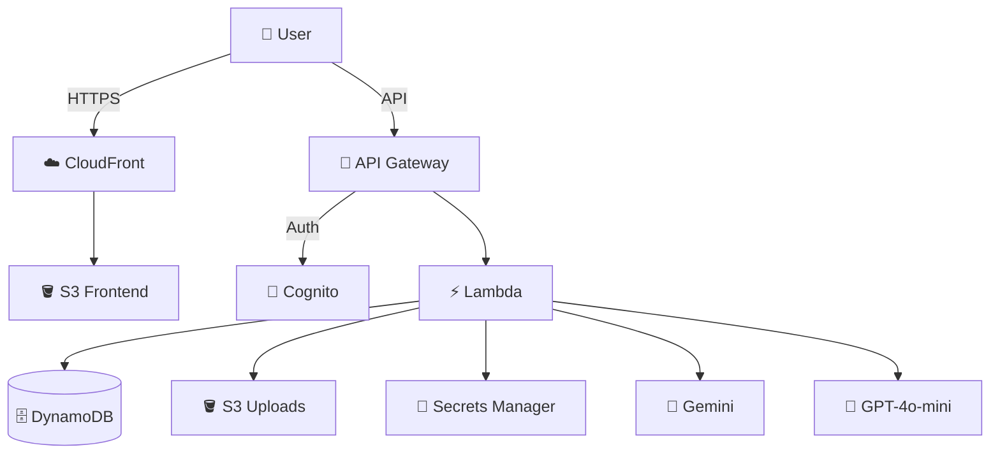

# 🏗️ Architecture ScamGuard v5.0

## Architecture Complète

```mermaid
graph TB
    USER[👤 User] -->|HTTPS| CF[☁️ CloudFront]
    CF --> S3F[🪣 S3 Frontend]
    USER -->|API| APIGW[🚪 API Gateway]
    APIGW -->|Auth| COGNITO[🔑 Cognito]
    APIGW --> LAMBDA[⚡ Lambda]
    LAMBDA --> DDB[(🗄️ DynamoDB)]
    LAMBDA --> S3U[🪣 S3 Uploads]
    LAMBDA --> SM[🔐 Secrets Manager]
    LAMBDA --> GEMINI[🤖 Gemini]
    LAMBDA --> OPENAI[🤖 GPT-4o-mini]
```

## Coûts: $4-5/mois
