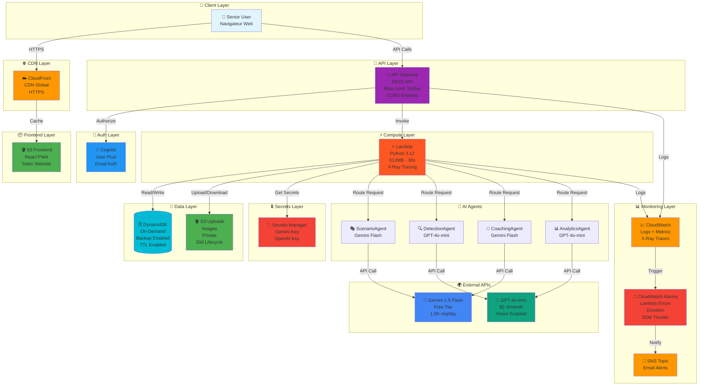
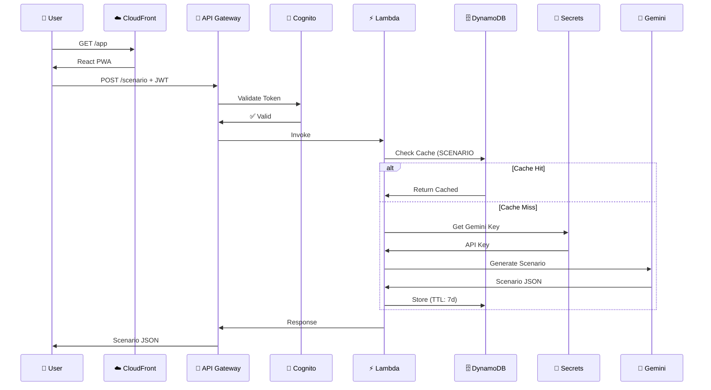
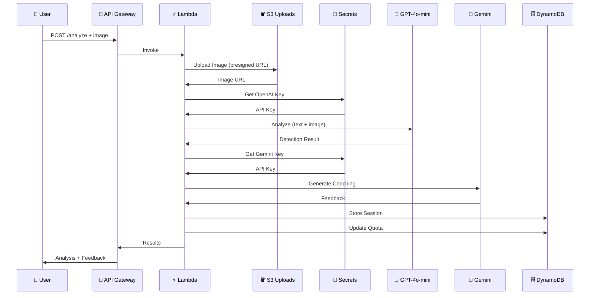
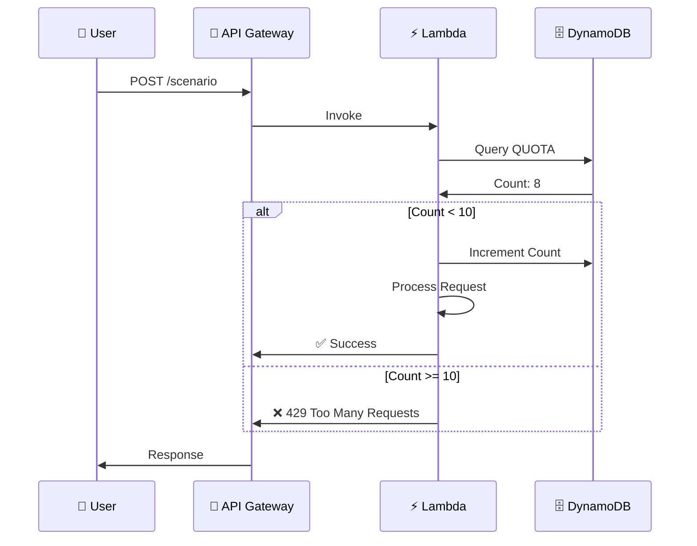
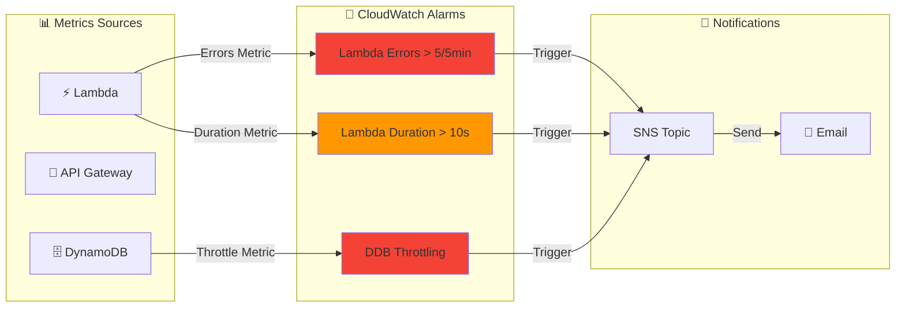
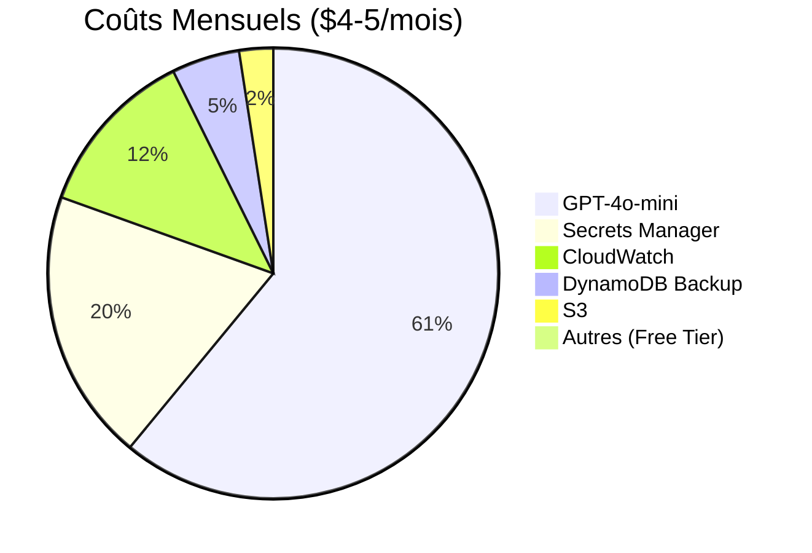
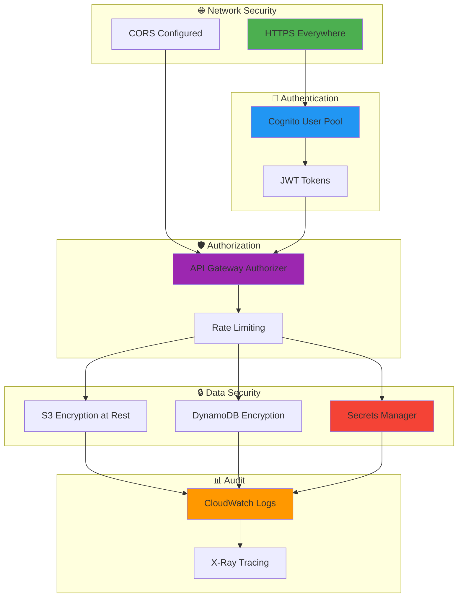

# 🏗️ Architecture ScamGuard v5.0 - Diagramme Visuel

## Architecture Complète



## Flux de Données Détaillé

### 1️⃣ Génération de Scénario



### 2️⃣ Analyse de Message (avec Image)



### 3️⃣ Rate Limiting



## Schéma DynamoDB

```mermaid
erDiagram
    USER_PROFILE {
        string PK "USER#123"
        string SK "PROFILE"
        string email
        int age
        string level
        int xp
        array badges
        timestamp created_at
    }
    
    USER_SESSION {
        string PK "USER#123"
        string SK "SESSION#2025-03-16T10:30:00"
        string scenario_id
        int score
        array red_flags_found
        array red_flags_missed
        string feedback
        int xp_earned
        timestamp created_at
    }
    
    USER_ANALYTICS {
        string PK "USER#123"
        string SK "ANALYTICS"
        int total_sessions
        float avg_score
        array strengths
        array weaknesses
        string trend
        timestamp updated_at
    }
    
    USER_QUOTA {
        string PK "USER#123"
        string SK "QUOTA#2025-03-16"
        int count
        int TTL "Expire at midnight"
    }
    
    SCENARIO_CACHE {
        string PK "SCENARIO#abc123"
        string SK "METADATA"
        string title
        string content
        array red_flags
        string correct_action
        int TTL "7 days"
    }
```

## Monitoring & Alarms



## Coûts par Service



## Sécurité - Layers



---

## 📝 Légende

| Icône | Service | Coût |
|-------|---------|------|
| ☁️ | CloudFront | $0 (free tier) |
| 🪣 | S3 | $0.10/mois |
| 🚪 | API Gateway | $0 (free tier) |
| 🔑 | Cognito | $0 (free tier) |
| ⚡ | Lambda | $0 (free tier) |
| 🗄️ | DynamoDB | $0.20/mois (backup) |
| 🔐 | Secrets Manager | $0.80/mois |
| 🤖 | Gemini Flash | $0 (free tier) |
| 🤖 | GPT-4o-mini | $2-3/mois |
| 📈 | CloudWatch | $0.50/mois |

**Total: $4-5/mois pour 10 utilisateurs**

---

**Généré pour:** ScamGuard v5.0  
**Date:** Mars 2025  
**Status:** ✅ Production-Ready
